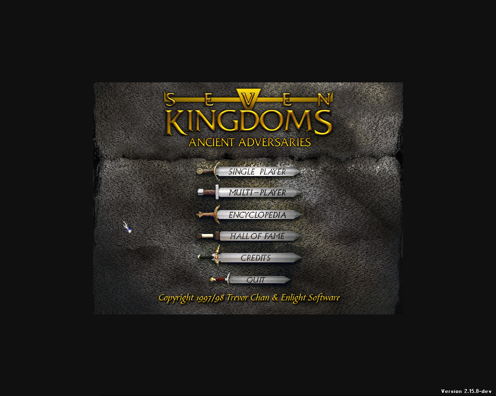
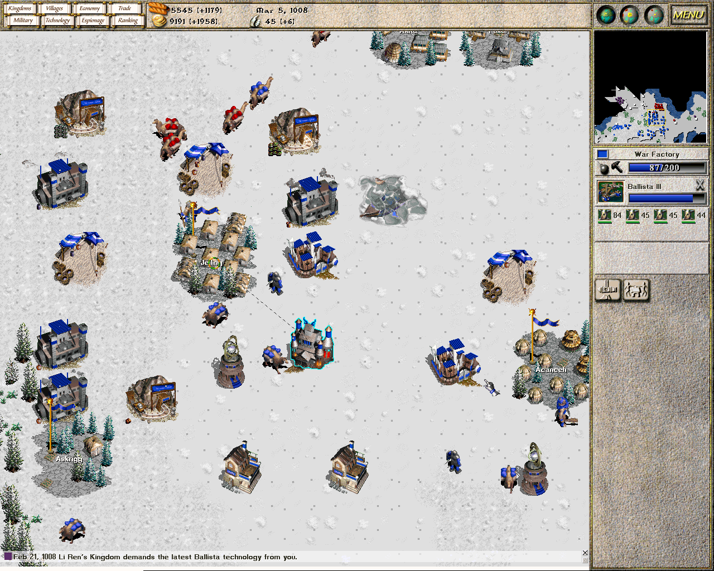

# Seven Kingdoms: Ancient Adversaries (HD support)

HD resolution patch and UI fixes for **7kaa (Seven Kingdoms: Ancient Adversaries)** based on the latest official source.

## 📌 Overview

This repository is a modified version of the official **7kaa v2.15.8** (latest commit: 2026-04-04), enhanced with modern HD resolution support and several UI improvements.

It builds upon prior HD work and refines it further with additional fixes and usability improvements.

## Screenshots




## ✨ Features

### 🖥️ Supported Resolutions

The engine now supports **custom resolutions up to 3180×2160**.

Example supported aspect ratios:

#### 4:3

* 800×600
* 1024×768
* 1600×1200

#### 5:4

* 1280×1024

#### 16:9

* 1280×720
* 1920×1080
* 2560×1440

### 🛠️ Fixes & Improvements

* **Main Menu → Training**

  * Fixed text overlapping issues
  * Fixed scrollbar redraw when switching menu options with a single click

* **Load/Save Screen**

  * Properly centered on screen across all supported resolutions

* **Configuration**

  * Resolution setting is now configurable via `config.txt`

## ⚙️ Configuration

The game resolution is controlled through the `config.txt` file.

### 📍 Config File Locations

**Linux**

```
/home/<your_user>/.local/share/7kfans.com/7kaa/
```

**Windows**

```
%appdata%/7kfans.com/7kaa/
```

### 🧾 Example `config.txt`

```
# custom game resolution
vga_resolution_width=1280
vga_resolution_height=1024
```
---

## 📥 Cloning the Repository

```bash
git clone https://github.com/kresimirv/7kaa_HD.git
```

## 🐧 Linux Build Instructions

### Required Build Tools

* gcc / g++
* make
* autoconf
* automake

### Build

```bash
git clean -dxf
autoreconf -vif
./configure && make -j$(nproc)
```

## 🔧 Base Project

This project is based on:

* Official 7kaa v2.15.8 source
* Community HD improvements from earlier work (https://github.com/starportx/7kaa)

## 🚀 Purpose

The goal of this repository is to modernize the original game experience by:

* Enabling higher resolutions
* Fixing UI issues that appear at larger screen sizes
* Preserving original gameplay and compatibility
* Keeping engine modifications lightweight and maintainable

## 📷 Notes

This is a lightweight enhancement project — no gameplay changes, only visual and usability improvements.
